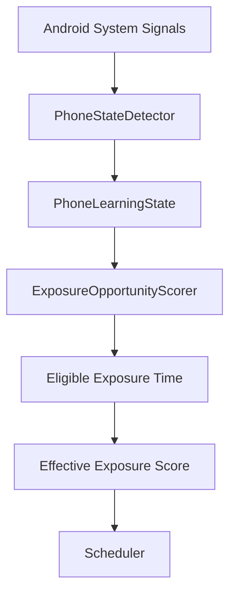

# Activity-Based Learning

FlipWords uses local Android signals to decide whether a displayed word had a reasonable chance to be seen.

## Phone States

- `ASLEEP_OR_INACTIVE`: multiplier `0.0`
- `LOCKED_IDLE`: multiplier `0.1`
- `GLANCE_OPPORTUNITY`: multiplier `0.5`
- `ACTIVE_PHONE_USE`: multiplier `1.0`
- `FULL_APP_LEARNING`: multiplier `1.5`
- `MOVING_OR_WORKOUT`: multiplier `0.3`
- `UNKNOWN`: multiplier `0.3`

## Android Signals

- `Intent.ACTION_SCREEN_ON`
- `Intent.ACTION_SCREEN_OFF`
- `Intent.ACTION_USER_PRESENT`
- `PowerManager.isInteractive()`
- Full app opens through the activity lifecycle

`ACTION_SCREEN_ON` and `ACTION_SCREEN_OFF` are dynamically registered by the overlay service.

## Sleep/Inactivity Rule

If the device is non-interactive for more than `INACTIVITY_PAUSE_THRESHOLD_MINUTES = 90`, FlipWords:

- Freezes the current word.
- Does not rotate to new words.
- Does not count exposure.
- Does not burn through missed slots.
- Resumes with one appropriate word when the user becomes active.

Given 9 hours of sleep, the scheduler must not mark six words as displayed and must not count 9 hours of exposure.

## Optional Signals

Activity Recognition and DND context are feature-flagged off. Samsung Health or Galaxy Watch integration is future work, not a current dependency.

## Privacy

FlipWords processes learning-state and phone-state signals locally. These signals are used to avoid fake exposure during inactive periods.

## References

- Android Intent API reference — screen and user-present broadcasts.
- Android NotificationManager API reference — interruption filter / DND handling.
- Google Activity Recognition API documentation.
