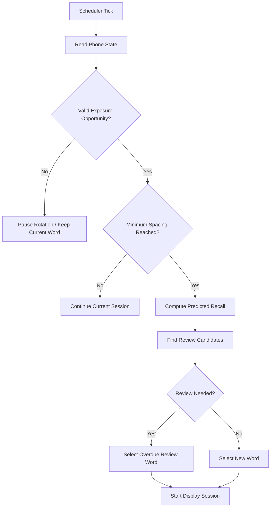

# FlipWords Scheduler

FlipWords uses adaptive spaced-repetition for passive exposure. It estimates progress from exposure signals; it does not claim to measure recall.

## Why Fixed Rotation Was Removed

A fixed rotator changes words while the user is asleep, away, working out, or not likely to see the cover screen. FlipWords treats `DEFAULT_MINIMUM_SPACING_MINUTES` as the starting minimum spacing target; users can adjust that target from the Schedule tab.

## Flow



## Memory Model

Effective exposure:

```text
1.0 * valid_display_sessions
+ 0.5 * capped_screen_on_exposure_units
+ 0.8 * unlocks_while_active
+ 1.5 * full_app_opens_while_active
+ 2.0 * distinct_days_seen
+ 2.5 * taps_while_active
```

Estimated half-life:

```text
min(MAX_HALF_LIFE_HOURS, BASE_HALF_LIFE_HOURS * HALF_LIFE_GROWTH_FACTOR ^ effective_exposures)
```

Predicted recall:

```text
2 ^ (-hours_since_last_seen / estimated_half_life_hours)
```

These are passive estimates, not proof that a word is truly remembered.

## Review/New Split

The scheduler normally targets a 30% review / 70% new split. When many words are overdue, review share can rise to 50%. When few are overdue, review share drops toward 20%.

## Word States

- `NEW`: barely seen.
- `LEARNING`: being reinforced.
- `FAMILIAR`: seen enough across multiple sessions.
- `STABLE`: strong estimated familiarity, shown less often.
- `MASTERED`: enough passive exposure for rare maintenance.
- `RETIRED`: excluded from normal rotation, kept in history.
- `HIDDEN`: user-hidden; never scheduled unless restored.

## Mastered, Retired, Hidden

Mastered words are excluded from normal frequent rotation and may reappear after `RARE_MAINTENANCE_REVIEW_DAYS`. Hidden words are user-controlled and never scheduled until restored.

## Passive Prompt Modes

Display modes are `FULL_CARD`, `HANZI_ONLY`, `PINYIN_PROMPT`, `MEANING_PROMPT`, and `REVEAL_CARD`.

Examples:

- Which word means “to remember”?
- Do you recall the Hanzi for “nín hǎo”?

The overlay does not collect quiz answers. Prompt modes are passive retrieval prompts, followed by reveal-style sessions.

## References

- Burr Settles and Brendan Meeder, “A Trainable Spaced Repetition Model for Language Learning” — Duolingo Half-Life Regression.
- Cepeda et al., “Distributed Practice in Verbal Recall Tasks: A Review and Quantitative Synthesis” — spacing effect.
- Karpicke and Roediger / Roediger and Butler retrieval-practice papers — retrieval practice and long-term retention.
- Android Intent API reference — `ACTION_SCREEN_ON`, `ACTION_SCREEN_OFF`, `ACTION_USER_PRESENT`.
- Google Activity Recognition API documentation.
- Android NotificationManager API reference — interruption filter / DND handling.
